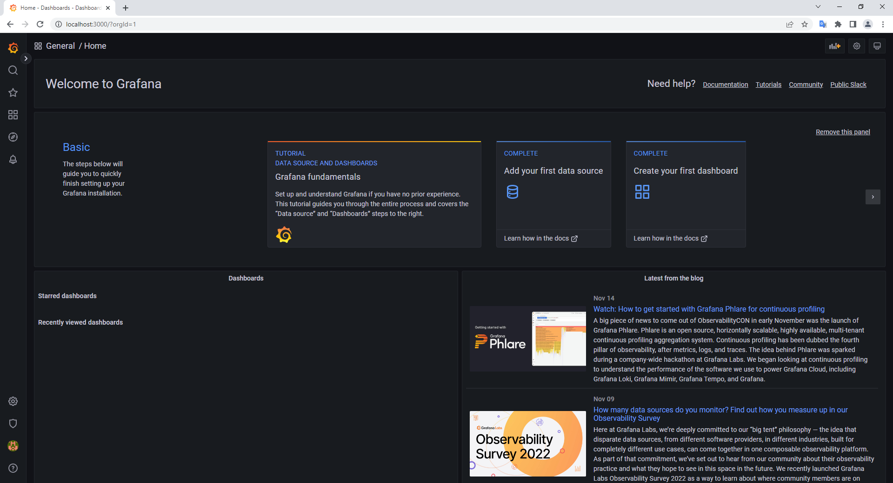
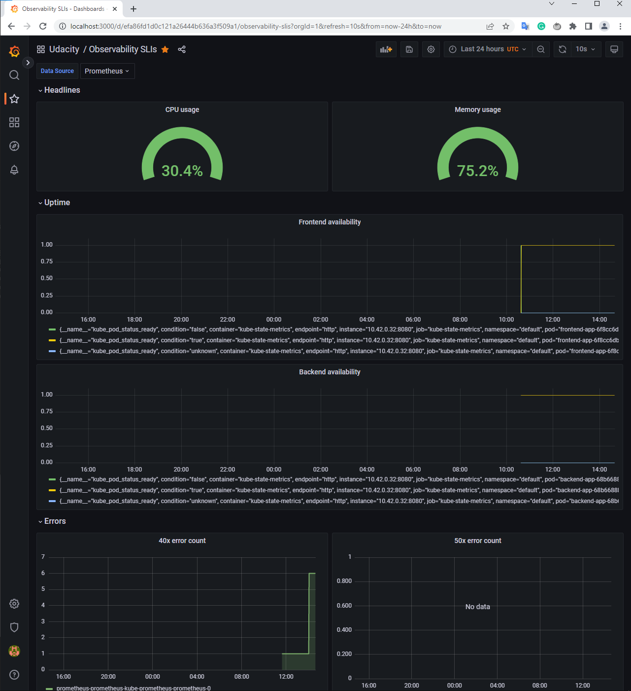

**Note:** For the screenshots, you can store all of your answer images in the `answer-img` directory.

## Verify the monitoring installation
*TODO:* run `kubectl` command to show the running pods and services for all components. Take a screenshot of the output and include it here to verify the installation

## Setup the Jaeger and Prometheus source
*TODO:* Expose Grafana to the internet and then setup Prometheus as a data source. Provide a screenshot of the home page after logging into Grafana.

## Create a Basic Dashboard
*TODO:* Create a dashboard in Grafana that shows Prometheus as a source. Take a screenshot and include it here.

## Describe SLO/SLI
*TODO:* Describe, in your own words, what the SLIs are, based on an SLO of *monthly uptime* and *request response time*.
SLO: measurable goal to ensure a standard level of performance during a period of time. e.g.: 99.99% uptime per month 
SLI: specific metric to measure a service performance. e.g.: HTTP requests will take 10ms or less to complete (on average) each month.

## Creating SLI metrics.
*TODO:* It is important to know why we want to measure certain metrics for our customer. Describe in detail 5 metrics to measure these SLIs. 
latency - duration that a request is waiting to be handled
availability - fraction of time that a service is available
error rate - to measure number or level of errors throughout curstomer experience
throughput - to measure requests per second or sum of all data delivered 
response time - total time it takes for the web service to respond to the sent request

## Create a Dashboard to measure our SLIs
*TODO:* Create a dashboard to measure the uptime of the frontend and backend services We will also want to measure to measure 40x and 50x errors. Create a dashboard that show these values over a 24 hour period and take a screenshot.

## Tracing our Flask App
*TODO:*  We will create a Jaeger span to measure the processes on the backend. Once you fill in the span, provide a screenshot of it here. Also provide a (screenshot) sample Python file containing a trace and span code used to perform Jaeger traces on the backend service.

## Jaeger in Dashboards
*TODO:* Now that the trace is running, let's add the metric to our current Grafana dashboard. Once this is completed, provide a screenshot of it here.

## Report Error
*TODO:* Using the template below, write a trouble ticket for the developers, to explain the errors that you are seeing (400, 500, latency) and to let them know the file that is causing the issue also include a screenshot of the tracer span to demonstrate how we can user a tracer to locate errors easily.

TROUBLE TICKET

Name: 500 error on /trace

Date: 10-DEC-2022, 9:07

Subject: Service route /trace is showing error 500

Affected Area:

Severity: High

Description:

## Creating SLIs and SLOs
*TODO:* We want to create an SLO guaranteeing that our application has a 99.95% uptime per month. Name four SLIs that you would use to measure the success of this SLO.
Resource consumption - CPU and memory usage
Service availability - Backend/Frontend availability
Response error occurence - HTTP 4xx and 5xx status code
Service reponse - Number of request and Response time

## Building KPIs for our plan
*TODO*: Now that we have our SLIs and SLOs, create a list of 2-3 KPIs to accurately measure these metrics as well as a description of why those KPIs were chosen. We will make a dashboard for this, but first write them down here.
Server CPU and memory usage, ensure sufficient resources is provided to the application to minimize potential issue.
- Server CPU usage
- Server memory usage

Mesure the availability of services to ensure it is accessible to the endpoints access.
- Measure backend availability
- Measure frontend availability

Track and measure potential non-sucessful request obtained (any status code that is not 200)
- Error 4xx mesure
- Error 5xx mesure

Services Request and response time averagely needed per request.
- Total requests per minute
- Average response

## Final Dashboard
*TODO*: Create a Dashboard containing graphs that capture all the metrics of your KPIs and adequately representing your SLIs and SLOs. Include a screenshot of the dashboard here, and write a text description of what graphs are represented in the dashboard.  
#� �O�b�s�e�r�v�a�b�i�l�i�t�y�
�
�#� �O�b�s�e�r�v�a�b�i�l�i�t�y�
�
� 
